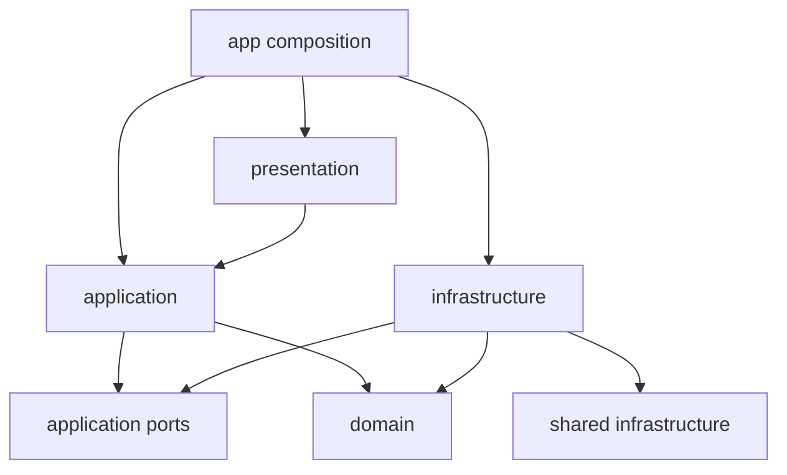

# Clean Architecture cho web foundation

## Dependency rule

Feature-first, layer bên trong feature. Domain/application là TypeScript thuần; compile riêng với ES2022, không DOM/Node globals và thư viện ngoài.

Source dependency đi vào trong; lời gọi runtime có thể đi ra adapter qua port. App tạo dependencies và inject qua providers. Feature không import app hoặc internals của feature khác. Shared không import feature/app.

Architecture gate dùng TypeScript resolver/AST, kiểm tra type-only/dynamic imports và cycles; core compile chặn globals của platform. Infrastructure không import presentation hoặc shared/ui/components/hooks/types/contexts/providers/lib. Shared/types được xác định là presentation, không phải mọi loại type.

## State

| State                            | Owner                                     |
| -------------------------------- | ----------------------------------------- |
| Entity/list/detail/loading/error | TanStack Query                            |
| Theme/language                   | Redux Toolkit + thunk tại app/preferences |
| Form values/touched/dirty/errors | React Hook Form                           |
| Search/page shareable            | URL                                       |
| Confirm modal                    | Local component state                     |
| Notification                     | Shared notification provider              |
| Access token                     | Auth session closure                      |
| Error diagnostics                | Bounded in-memory adapter; không payload  |

DTO được validate tại infrastructure và map sang domain. Không persist Query cache hoặc tokens trong Redux/localStorage. Storage preference xử lý denial/quota bằng fallback memory.

React Router lưu bản đồ vị trí cuộn dạng số trong sessionStorage để khôi phục khi điều hướng/reload; không lưu token hoặc server data ở đó.

## Contracts và errors

HTTP service trả envelope đầy đủ theo API mẫu; repository unwrap và map. ApiResponse là tên contract mẫu trong template, không buộc backend mọi sản phẩm dùng đúng envelope này. Khi thay backend, thay transport boundary và fixtures đồng bộ; không cho consumer chấp nhận union raw/envelope.

DomainError chứa invariant/code. AppError chứa kind/code/retryable; HttpError chỉ ở infrastructure. Cancellation đi qua port thuần rồi bridge sang AbortSignal tại adapter.

GET retry tối đa hai lần cho transient network/5xx. Mutation không retry network/5xx, không tự queue offline. HTTP auth replay tối đa một lần sau 401 theo điều kiện backend từ chối trước side effect. 409/412 là conflict; 429 rate-limit; timeout có thông báo riêng.

## Projects làm mẫu

List/create/get/update/delete, URL search/page, query key prefix theo feature. PUT/DELETE gửi version qua If-Match. Mock server tăng version sau update và trả 412 cho stale writes. UI giữ input khi lỗi, không tự merge hoặc blind retry.

Shared UnsavedChangesDialog dùng router blocker cho SPA và beforeunload cho document navigation. Browser quyết định có hiển thị beforeunload prompt không; không có đảm bảo phục hồi form sau crash. Delete dùng xác nhận qua Radix. Notification không tự dismiss để người dùng có thời gian đọc; tối đa bốn mục.

## Composition và extensibility

App/config sở hữu rollout flag; app/observability nối window/React/router events. Shared reporter port được Query adapter gọi; adapter chỉ ghi source/kind/timestamp, giữ tối đa 50 event. Thay sink để nối telemetry sau khi có chính sách dữ liệu; chưa gửi log ra mạng.

Tiền tệ là tham số formatter. Timezone là env được validate (mặc định UTC). Projects cố ý dùng budget nguyên USD như domain ví dụ; không đổi currency chỉ ở UI để giả lập quy đổi tiền.

Không thêm generic repository, DI container hoặc kế thừa base-service chỉ để giảm số dòng. Factory + structural ports đủ cho starter. Xem [structure](project-structure.md), [naming](naming.md), [capabilities](capabilities.md).
